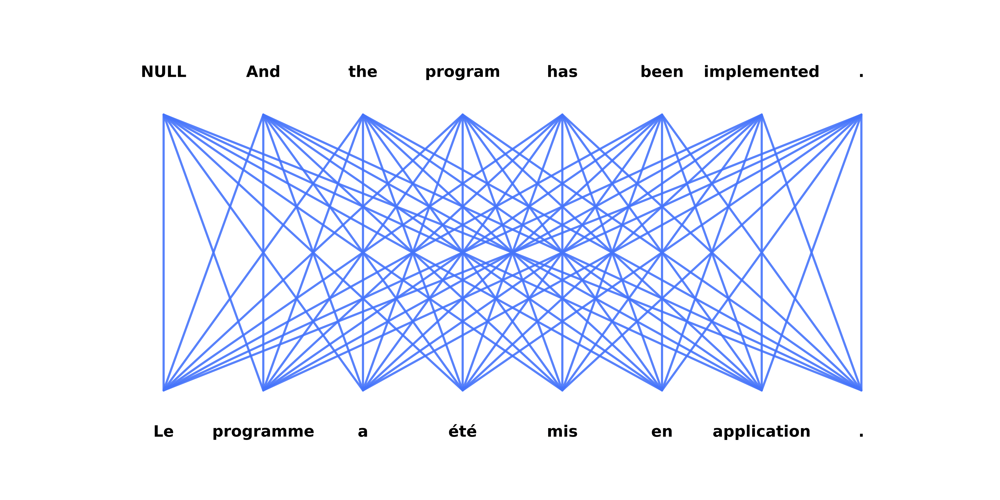

# IBM-Models
Implementation of the alignment models IBM 1 and IBM 2 for the UvA course NLP2. Parameter estimation is performed using EM for the regular formulation of IBM 1 and 2, and Variational Inference for a Bayesian Formulation of IBM1. 

See the [project description](project1.pdf) for more details, and the [final report](report/final-report.pdf) for our findings.

## Alignments
See how the alignment probabilities change over training epochs:



These alignments were obtained with 4 iterations of IBM model 2 over the full 250k sentence dataset.

## Requirements
```
pip install tabulate
pip install progressbar2
```